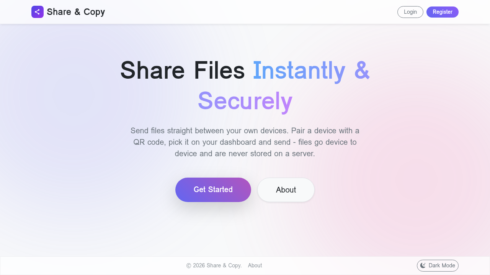

# Share & Copy

Send files directly between your own devices — no uploads, no shareable links, no waiting around.

## What it is

Share & Copy lets you move files straight from one of your devices to another over a private, direct connection. Sign in on each device you own, and your files travel device-to-device — they're never uploaded to or stored on a server in between.

## Features

* **Direct, private transfers** — files move peer-to-peer between your devices; the server only helps them find each other, it never sees file contents.
* **Simple device pairing** — add a new device to your account by scanning a QR code or entering a short one-time pairing code, no need to type your password on a new device.
* **See your devices online** — your dashboard shows which of your devices are online right now and ready to receive a file.
* **Automatic safety checks** — potentially unsafe file types (executables, scripts, and similar) are blocked automatically.
* **Revoke access anytime** — lost a device or don't use it anymore? Remove it from your account instantly.
* **Installable app** — add Share & Copy to your home screen and it runs like a native app, staying signed in between uses and launching even on a poor connection.
* **Notifications** — get told when a file is on its way to a device, when a new device asks to pair, or when something changes on your account. Each device picks what it wants to hear about.

## Getting started

1. **Create an account** with your email and a password.
2. **Add your other devices** — open Share & Copy on them and either sign in, or use "Add Device" to pair them by scanning a QR code or entering a pairing code.
3. **Send a file** — go to your dashboard, pick a device that's online, choose a file, and send. It transfers directly to that device.

## Install it as an app

Open Share & Copy in your browser and use "Install app" (Chrome, Edge) or Share → "Add to Home Screen" (Safari). Installed, it keeps you signed in the way a native app does, works offline for everything that doesn't need the network, and can send notifications. On iPhone and iPad, notifications are only available once the app is installed to the home screen.

## Privacy & security

* Files are transferred directly between your devices — the server never stores or has access to file contents.
* Passwords are hashed before being stored; sign-ins use short-lived access tokens with refresh rotation.
* You can revoke any device's access to your account at any time.

## For developers

Looking to run Share & Copy locally or contribute? See [docs/CONTRIBUTING.md](docs/CONTRIBUTING.md).

For how sessions, the service worker and push notifications work — and how to deploy the client and server on separate hosts — see [docs/PWA.md](docs/PWA.md).
